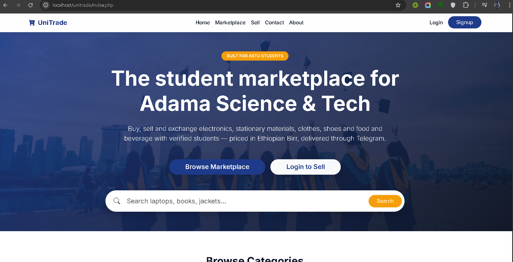
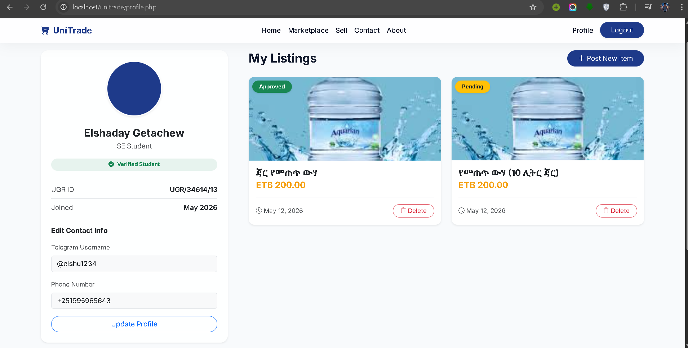
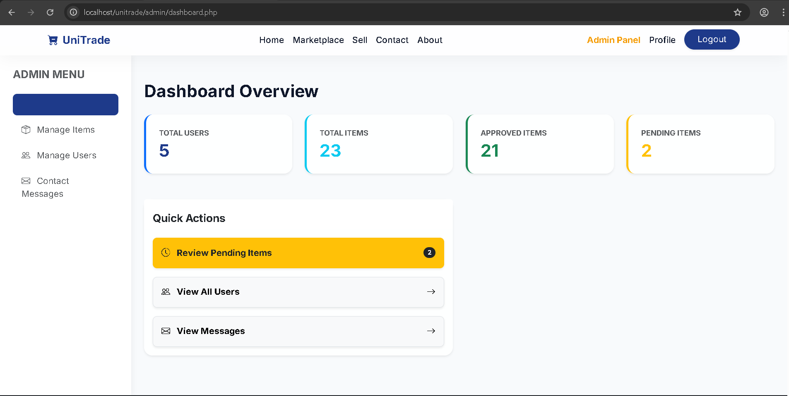
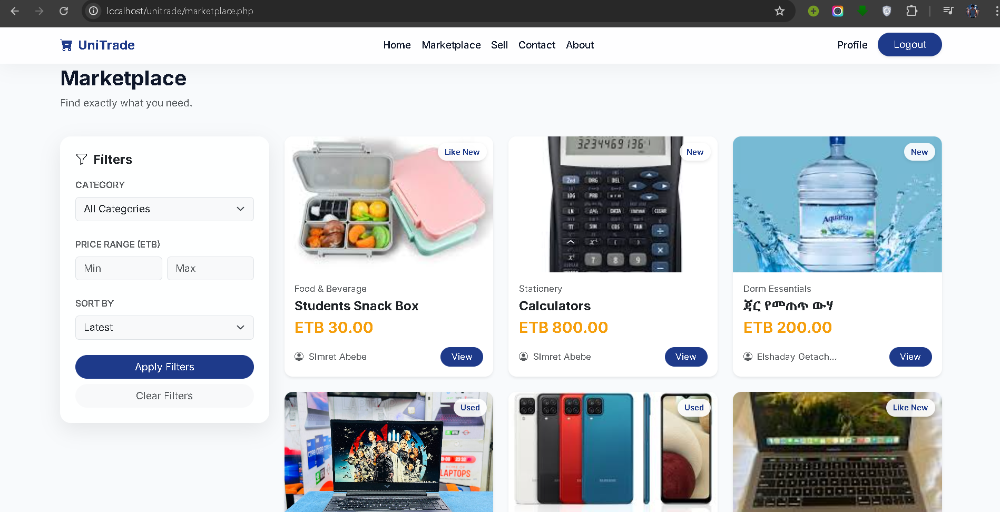

# 📘 UniTrade Student Marketplace & Resource Exchange System

## 🏫 ADAMA SCIENCE AND TECHNOLOGY UNIVERSITY (ASTU)
Department of Software Engineering  
Course: Engineering Web-Based System (SEng3202)

---

## 👨‍🎓 Team Members

- Faysel Nessro — Ugr/34398/16  
- Eyoab Nigusie — Ugr/34353/16  
- Fitsum Kurabachew — Ugr/34462/16  
- Simret Mesfin — Ugr/35426/16  
- Yeabsira Getachew — Ugr/35614/16  
- Biruk Abebe — Ugr/25917/14  

---

**Submitted to:** Mr. Alemayew Megersa  
**Submission Date:** May 14, 2026  

---

# 📌 Project Overview

UniTrade is a student-to-student marketplace platform designed for ASTU students.  
It enables students to buy, sell, and exchange items such as electronics, clothing, stationery, dorm materials, and food.

The platform ensures safe trading through:
- Verified student accounts
- Admin approval system
- Telegram-based communication

---

# 🎯 Objectives

- Build a campus-based digital marketplace  
- Ensure safe and verified student trading  
- Provide fast communication via Telegram  
- Offer simple and responsive UI design  

---

# ⚙️ Features

## 👤 User System
- Student registration & login
- Profile management
- Seller verification system

## 🛒 Marketplace
- Category-based browsing
- Search & filter system
- Detailed item pages

## 📤 Selling System
- Upload items with images
- Admin approval workflow
- Status tracking (Pending / Approved / Rejected)

## 💬 Communication
- Telegram contact integration
- Feedback system

---

# 🧱 Tech Stack

- Frontend: HTML5, CSS3, Bootstrap, JavaScript  
- Backend: PHP  
- Database: MySQL (XAMPP)  
- Icons: Bootstrap Icons  

---

## 🖼️ Screenshots

### 🏠 Home Page

### 🛒 Profile

### 🔐 Login Page

### 📊 Admin Dashboard

### 🔐 Marketplace Page

### 📊 Items 

# 📁 Project Structure

├── index.php
├── login.php
├── signup.php
├── logout.php
├── marketplace.php
├── item.php
├── profile.php
├── sell.php
├── about.php
├── contact.php

├── admin/
│ ├── dashboard.php
│ ├── items.php
│ ├── users.php
│ ├── edit_item.php
│ ├── messages.php

├── includes/
│ ├── db.php
│ ├── auth.php
│ ├── header.php
│ ├── footer.php

├── css/
│ └── style.css

├── js/
│ └── app.js

├── uploads/
├── database/
│ └── unitrade.sql

---

# 🚀 Conclusion

UniTrade is a secure and efficient student marketplace system for ASTU.  
It improves student trading, communication, and campus digital economy.

Future improvements:
- Online payment system
- Rating & review system
- Mobile application
